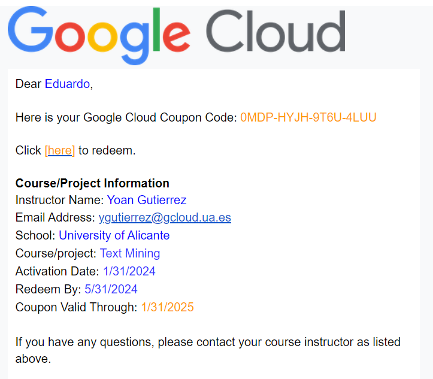
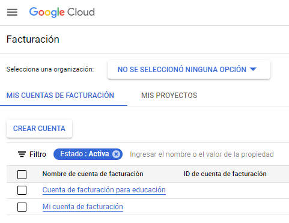
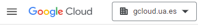
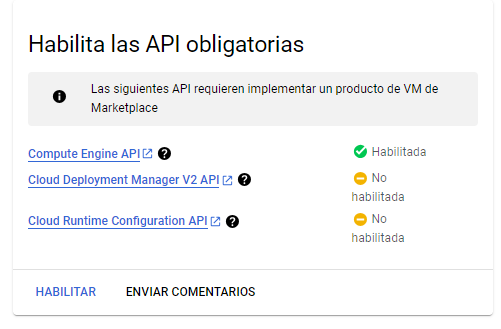
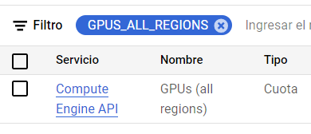
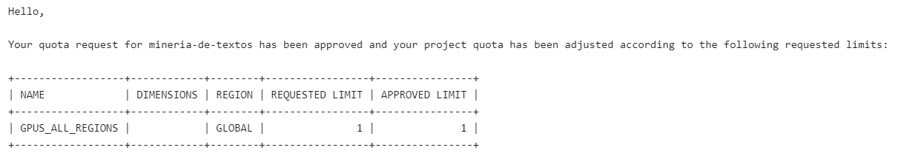
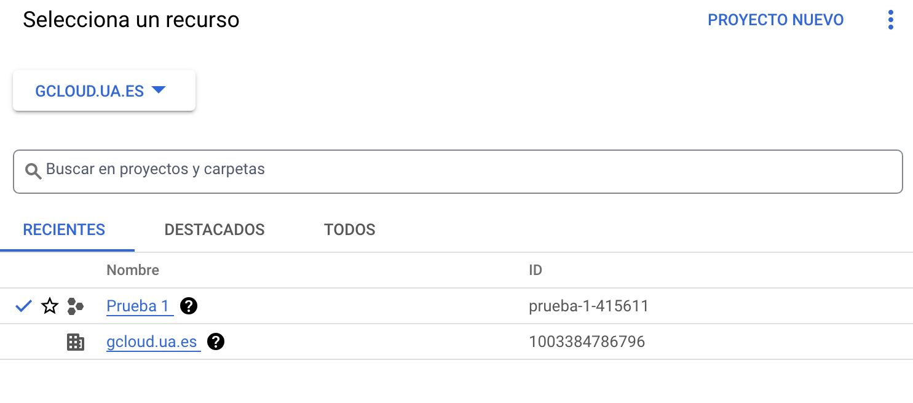
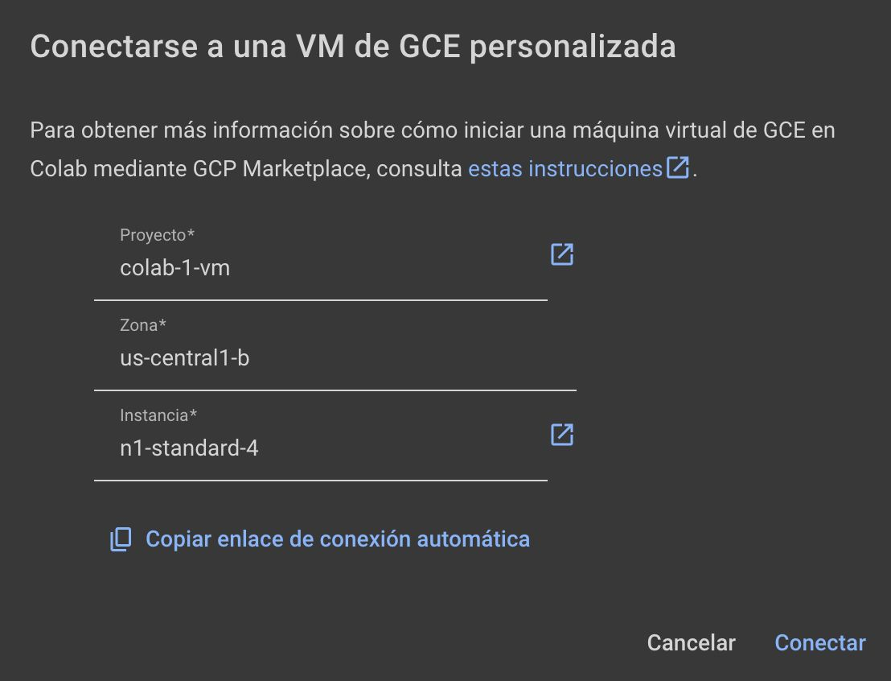

# Uso de Google Colab con una VM personalizada

<!--Guía elaborada por [Eduardo Grande Ruiz](https://cvnet.cpd.ua.es/curriculum-breve/es/grande-ruiz-eduardo/327690) para la utilización de una máquina virtual personalizada en Google Colab. -->

## Objetivo

Gracias a los créditos educativos que nos ha otorgado Google para este curso, cada estudiante contará con 50$ para gastar en Google Cloud.

Con este crédito, podemos crear una máquina virtual personalizada para ser usada por Google Colab. Esto nos permitirá tener los siguientes beneficios:

- Disponibilidad de recursos: La máquina virtual estará siempre disponible para nosotros (hasta agotar el crédito disponible).
- Disco persistente: Los datos generados y/o almacenados en la VM no se perderán, serán persistentes cada vez que nos conectemos.
- Mayores recursos: Contaremos con más recursos que los ofrecidos de base por Google Colab (esto dependerá de la máquina que finalmente cada estudiantes elija).

Por contra, debemos de tener en cuenta algunas limitaciones:
- Cuando nos conectemos a este entorno, no tendremos acceso a los archivos que tengamos en Google Drive.
- Debemos de ser **muy cuidadosos con el tiempo de uso**. La máquina consume crédito (dinero) por cada minuto conectada. Por tanto, **asegúrate de desconectarla cuando no la estés utilizando** (ve al final de esta web para ver como apagarla).

## Creación de la máquina

Se detallan a continuación los pasos a seguir para la creación de la máquina virtual. En caso de duda, no dudes en preguntar al profesor en clase o por [tutoría](https://cvnet.cpd.ua.es/uaTutorias/Emisor/hacer).

Para realizar todo el proceso, se recomienda que en el navegador solo tengas iniciada sesión en Google con tu cuenta *gcloud.ua.es*. En caso de no ser así, abre una pestaña de incógnito e inicia sesión solo con esta cuenta.

1. Tener cuenta activa *gcloud.ua.es*. En caso de no tenerla, puedes solicitarla desde la aplicación de Servicios Externos de UACloud.
2. En tu Gmail de tu cuenta gcloud, habrás recibo un correo como el que se muestra en la imagen siguiente. Pincha en el enlace (donde pone *link* en azul) para verificar tu cuenta.

3. Tras verificar tu cuenta, recibirás otro correo de Google Cloud (se muestra a continuación). Pincha en el enlace (donde pone *[here]* en naranja) para activar los créditos en tu cuenta de Google Cloud

4. Ahora, rellena los campos que te piden (Nombre y apellidos), así como especificar el código del cupón (lo tienes en el último correo recibido, puedes copiarlo y pegarlo). Al rellenarlo todo, pincha en *ACEPTAR Y CONTINUAR*.
5. Si nunca has accedido a Google Cloud con esta cuenta, te pedirá que aceptes las Condiciones de Servicio. Acepta y pincha en *ACEPTAR Y CONTINUAR*.
4. Una vez creado, puedes acceder a la página de [Facturación de Google Cloud](https://console.cloud.google.com/billing) (es a la que te habrá redirigido) y verás que tienes 50$ de crédito para gastar. Para ello:
    1. Pincha en Cuenta de facturación para educación
    
    3. En el menú lateral izquierdo, pincha en Créditos.
    
    5. Ahí, verás como te aparecen los 50$ en créditos que tienes disponibles.
4. Ahora, dentro de la [Consola de Google Cloud](https://console.cloud.google.com/), crea un proyecto. Ese proyecto lo debes de asociar a tu cuenta de créditos educativos.
    1. Pincha en el desplegable donde pone *gcloud.ua.es*

    2. Pincha en el botón *PROYECTO NUEVO* (Sale arriba a la derecha de la ventana).
    3. Ponle un nombre al proyecto y asegurate que se queda como la imagen. (Puede ser que el desplegable de "Cuenta de facturación" no te aparezca). Al acabar, pincha en Crear.

5. Espera... Taradará unos segundos en crear un proyecto. Verás que acaba de crear cuando todas las notificaciones de la barra lateral que ha aparecido están en verde.
6. Una vez creado, pincha otra vez en el desplegable de *gcloud.ua.es* (arriba a la izquieda) y selecciona el proyecto que acabas de crear.
5. Ahora, puedes acceder a [Colab dentro de Google Cloud](https://console.cloud.google.com/marketplace/product/colab-marketplace-image-public/colab).
6. Pincha en *COMENZAR*
7. Acepta los Términos y acuerdos y pincha en Aceptar
8. Saltará un pop-up. Pincha en Implementar.

9. Habilita todas las APIs pinchando en Habilitar. Este proceso puede tardar unos minutos.

10. Al habilitarse, te redigirá a una página para crear tu máquina virtual. Volveremos aquí más tarde.
11. Ahora, dirígete a la página de [Cuotas de Google Cloud](https://console.cloud.google.com/iam-admin/quotas). Asegurate de que en el desplegable de arriba a la izquieda, tienes seleccionado el proyecto que has creado anteriormente.
12. Ahora, en el buscador de cuotas (a la derecha del botón de *Filtro*, donde la tabla que salen muchas filsa), busca *GPUS_ALL_REGIONS*

13. Selecciona el checkbox de esa propiedad, y pincha en *EDITAR CUOTAS*. En el menú que se te abre, establece *1* como valor nuevo. En descripción de la solicitud puedes poner algo como "Uso de una VM con GPU". Pincha en *SIGUIENTE* y despúes en *ENVIAR SOLICITUD* (no hace falta que pongas tu teléfono).
14. Ve a tu correo. Te habrá llegado un mail de confirmación al pedir el aumento de la cuota de GPUs. Segundos más tarde, te llegará otro aceptándote la solicitud. Si no te llega, espera un poco, puede tardar unos minutos. El mail contiene algo como:

15. Ahora ya podemos volver a la creación de la máquina virtual. Para ello, ve a la página de [Colab dentro de Google Cloud](https://console.cloud.google.com/marketplace/product/colab-marketplace-image-public/colab) y pincha en *INICIAR*.
14. Procedemos a crear la máquina. Te sugerimos la siguiente configuración (recuerda, cuanto más recursos pongas, más cara es la hora de cómputo de la máquina, por lo que antes se te acabarán los créditos). Establece los siguientes parámetros:
    - Deployment name: Ponle un nombre que quieras, *mv-mineria-de-textos* por ejemplo.
    - Zone: us-central1-b
    - Machine type: Selecciona GPU. Además, selecciona los siguientes parámetros:
        - Tipo de GPU: Tesla T4
        - Cantidad de GPU: 1
        - NO selecciones "Habilitar Virtual Workstation"
        - Tipo de máquina: n1-standard-4 (4 vCPUs, 15 GB de memoria)

    El resto de datos déjalos como están. Acaba pinchando en *IMPLEMENTAR*. Antes, comprueba que el precio mostrado coindice con el de la imagen siguiente.
    AVISO: Si ves que te sale un error diciendo que no tienes cuota para usar GPUs, espera, recarga la página y vuelve a probar.

    
5. Espera... Taradará unos minutos en crear la máquina. Verás que acaba de crear cuando sale en verde "Se implementó *nombre_de_tu_máquina*".
6. Ahora, pincha en *CONNECT TO VM WITH COLAB". Te redirigirá a una página de Colab. Abre cualquier notebook. No cierres tu pestaña anterior.
10. Pincha el desplegable que hay a la derecha del botón de *Conectar* y selecciona *Conectar a una VM de GCE personalizada*. Te pedirá el nombre del proyecto, zona e instancia. El nombre del proyecto lo tienes en el desplegable de arriba a la izquieda (tienes que copiar el ID, no el Nombre), el resto de datos los tienes en la pestaña anterior de creación de la máquina. Copialos y pegalos. Al acabar, pincha en conectar. 

11. Una vez veas que se ha conectado, **¡ya puedes usar la máquina!**. 
12. **MUY IMPORTANTE**: Cuando acabes de usar la máquina, **desconéctala**. Para ello:
    1. En Colab, pincha en el desplegable de la derecha donde te salen los recursos de RAM y Disco, pincha en "Gestionar sesiones" y elimina la sesión actual.
    2. En Google Gloud, ve a la página de [Compute Engine](https://console.cloud.google.com/compute/instances). Ahí, selecciona la máquina que has creado y pincha en el botón de *DETENER* (arriba a la izquieda). **Si no lo haces, seguirás consumiendo crédito.**
